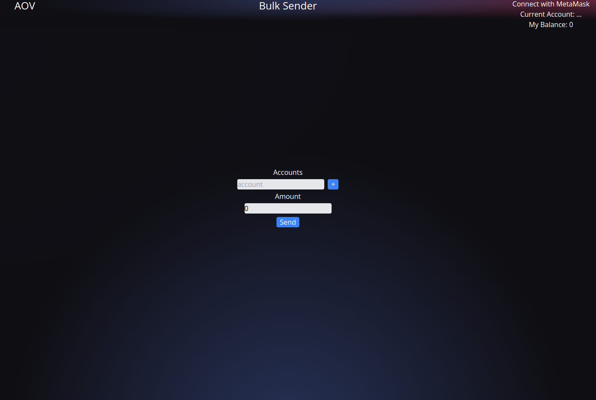

<!-- PROJECT LOGO -->
 

  <h1 align="center">AOV Token Bulk Sender</h1>

<!-- TABLE OF CONTENTS -->

  
Table of Contents

  <ol>
    <li>
      <a href="#about-the-project">About The Project</a>
      <ul>
        <li><a href="#bulksend-operator">BulkSend Operator</a></li>
        <li><a href="#bulksend-app">BulkSend App</a></li>
      </ul>
    </li>
    <li><a href="#getting-started">Getting Started</a></li>
    <li><a href="#usage">Usage</a></li>
  </ol>

<!-- ABOUT THE PROJECT -->
## About The Project

A web app for the BulkSend Operator that allows token holders to send a single amount to multiple recipients in one transaction. 

#### BulkSend Operator

An operator for ERC777 tokens that allows token holders to send tokens to multiple recipients Implemented in [BulkSend.sol](https://github.com/IVIosab/ERC777/blob/main/contracts/BulkSend.sol) 
The BulkSend allows the holder to send either a single amount to each of the recipients or a distinct amount of tokens for each recipient in a single transaction 
This operator can be used by any ERC777 compatible token 
 

(<a href="#top">back to top</a>)

#### BulkSend App

  

<!-- GETTING STARTED -->
## Getting Started
You can test the project via the deployed web apps for BulkSend and StaticSale operators.

* Install the [MetaMask](https://chrome.google.com/webstore/detail/metamask/nkbihfbeogaeaoehlefnkodbefgpgknn?hl=en) browser extension.
* Connect to the Rinkeby Testnet.
* Get RinkebyETH through the [Rinkeby Faucet](https://rinkebyfaucet.com/)
* Go to the [StaticSale web app](https://static-sale.vercel.app/) to buy AOV tokens with RinkebyETH from the creator address

Now you are all set
You have both RinkebyETH and AOV tokens and can start testing the tokens via 
* [BulkSend App](https://bulk-sender.vercel.app/)

<!-- USAGE EXAMPLES -->
## Usage

You can use the Bulksend and StaticSale web apps via the following links:
* [BulkSend App](https://bulk-sender.vercel.app/)
* [StaticSale App](https://static-sale.vercel.app/)

For more information on how to use the web apps, please refer to:
* [BulkSend App README](https://github.com/IVIosab/ERC777/blob/main/client/bulksender/README.md)
* [StaticSale App README](https://github.com/IVIosab/ERC777/blob/main/client/staticsale/README.md)

(<a href="#top">back to top</a>)

