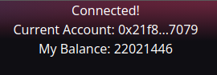
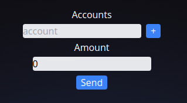

<!-- PROJECT LOGO -->
 

  <h1 align="center">AOV Token Bulk Sender</h1>

<!-- TABLE OF CONTENTS -->

  
Table of Contents

  <ol>
    <li>
      <a href="#about-the-project">About The Project</a>
      <ul>
        <li><a href="#bulksend-operator">BulkSend Operator</a></li>
        <li><a href="#bulksend-app">BulkSend App</a></li>
      </ul>
    </li>
    <li><a href="#getting-started">Getting Started</a></li>
    <li>
      <a href="#usage">Usage</a>
      <ul>
        <li><a href="#user-information-box">User Information Box</a></li>
        <li><a href="#bulk-send-ui">Bulk Send UI</a></li>
      </ul>
    </li>
  </ol>

<!-- ABOUT THE PROJECT -->
## About The Project

A web app for the BulkSend Operator that allows token holders to send a single amount to multiple recipients in one transaction. 

#### BulkSend Operator

An operator for ERC777 tokens that allows token holders to send tokens to multiple recipients Implemented in [BulkSend.sol](https://github.com/IVIosab/ERC777/blob/main/contracts/BulkSend.sol) 
The BulkSend allows the holder to send either a single amount to each of the recipients or a distinct amount of tokens for each recipient in a single transaction 
This operator can be used by any ERC777 compatible token 
 

(<a href="#top">back to top</a>)

#### BulkSend App

  

 
 
The web app allows the users to use the bulk send operator by inserting the designated recipients one address at a time 
Then, inserting the amount the user wants to send to each recipient 
Then, simply click the send button which will open MetaMask to give the user the information about the transaction and the option of rejecting or accepting the transaction 

<!-- GETTING STARTED -->
## Getting Started
You can test the project via the deployed web apps for BulkSend and StaticSale operators.

* Install the [MetaMask](https://chrome.google.com/webstore/detail/metamask/nkbihfbeogaeaoehlefnkodbefgpgknn?hl=en) browser extension.
* Connect to the Rinkeby Testnet.
* Get RinkebyETH through the [Rinkeby Faucet](https://rinkebyfaucet.com/)
* Go to the [StaticSale web app](https://static-sale.vercel.app/) to buy AOV tokens with RinkebyETH from the creator address

Now you are all set
You have both RinkebyETH and AOV tokens and can start testing the tokens via 
* [BulkSend App](https://bulk-sender.vercel.app/)

<!-- USAGE EXAMPLES -->
## Usage

The web app is composed of two major elements:
* User Information Box
* Bulk Send UI

#### User Information Box

  

In the top right corner of the app there is 3 lines that describe basic information about the user:  
1. Connection to the app with MetaMask 
2. Current connected account 
3. account's AOV balance 

#### Bulk Send UI

  

In the center of the app there is the major components related to the bulk send operator  
It consists of 3 parts: 
1. Accounts Inputs:  Where the user can insert the recipient's address and click the [+] button which will add that address to the list of recipients to send tokens to. After adding an address it will be pushed down to the list of addresses where beside each address there is [x] button which removes the address from the list 
2. Amount Input:  Where the user inserts the amount of tokens they want to send to each recipient 
3. Send Button:  Which upon getting clicked initiates the transaction process 

(<a href="#top">back to top</a>)

