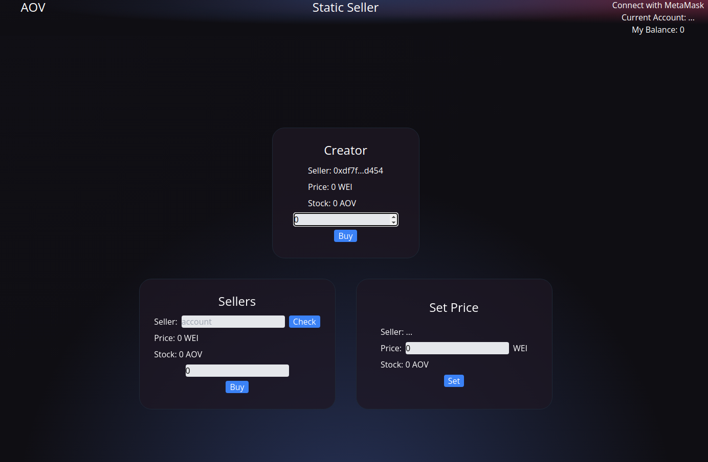
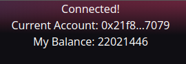
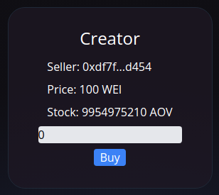
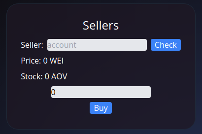
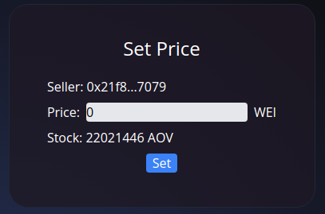

<!-- PROJECT LOGO -->
 

  <h1 align="center">AOV Token Static Seller</h1>

<!-- TABLE OF CONTENTS -->

  
Table of Contents

  <ol>
    <li>
      <a href="#about-the-project">About The Project</a>
      <ul>
        <li><a href="#staticsale-operator">StaticSale Operator</a></li>
        <li><a href="#staticsale-app">StaticSale App</a></li>
      </ul>
    </li>
    <li><a href="#getting-started">Getting Started</a></li>
    <li>
      <a href="#usage">Usage</a>
      <ul>
        <li><a href="#user-information-box">User Information Box</a></li>
        <li><a href="#creator-card">Creator Card</a></li>
        <li><a href="#sellers-card">Sellers Card</a></li>
        <li><a href="#set-price-card">Set Price Card</a></li>
      </ul>
    </li>
  </ol>

<!-- ABOUT THE PROJECT -->
## About The Project

A web app for the StaticSale Operator that allows token holders to register as sellers by setting their PricePerToken and allows people to buy tokens with ether from sellers 

#### StaticSale Operator

An operator that allows Selling and Buying tokens Implemented in [StaticPriceSeller.sol](https://github.com/IVIosab/ERC777/blob/main/contracts/StaticPriceSeller.sol) 
The StaticSale allows token holders to register as Seller by setting their PricePerToken 
And it also allows anyone to buy tokens from a seller by paying ether to the sellers 
This operator can be used by any ERC777 compatible token 
 

(<a href="#top">back to top</a>)

#### StaticSale App

  

 
 
The web app allows the users to Buy from either the Creator or other addresses that have put their tokens up for sale 
It also allows uses to put their tokens up for sale by Setting their PricePerToken 

<!-- GETTING STARTED -->
## Getting Started
You can test the project via the deployed web apps for BulkSend and StaticSale operators.

* Install the [MetaMask](https://chrome.google.com/webstore/detail/metamask/nkbihfbeogaeaoehlefnkodbefgpgknn?hl=en) browser extension.
* Connect to the Rinkeby Testnet.
* Get RinkebyETH through the [Rinkeby Faucet](https://rinkebyfaucet.com/)
* Go to the [StaticSale web app](https://static-sale.vercel.app/) to buy AOV tokens with RinkebyETH from the creator address

Now you are all set
You have both RinkebyETH and AOV tokens and can start testing the tokens via 
* [StaticSale App](https://static-sale.vercel.app/)

<!-- USAGE EXAMPLES -->
## Usage

The web app is composed of Four major elements:
* User Information Box
* Creator Card 
* Sellers Card
* Set Price Card

#### User Information Box

  

 
 
In the top right corner of the app there is 3 lines that describe basic information about the user:  
1. Connection to the app with MetaMask 
2. Current connected account 
3. account's AOV balance 

#### Creator Card

  

 
 
In the top center of the app there is the Creator Seller Card 
It consists of 3 parts: 
1. Creator Seller Information: 
Which includes the address of the creator, the PricePerToken and the remaining stock of the Creator 
2. Amount Input: 
Where the user inserts the amount of tokens they want to buy 
3. Buy Button: 
Which upon getting clicked initiates the buying process 

#### Sellers Card

  

 
 
In the left center of the app there is the Sellers Card 
It consists of 4 parts: 
1. Seller Address Input: 
Where the user inserts the address of the account they want to buy from. And after that they click the Check button which will update the Seller Information 
2. Seller Information: 
Which includes the PricePerToken and the remaining stock of the Seller 
Note: if the PricePerToken is set to 0 then that means the tokens are not for sale and the UI will show "Not For Sale" 
3. Amount Input: 
Where the user inserts the amount of tokens they want to buy 
4. Buy Button: 
Which upon getting clicked initiates the buying process 

#### Set Price Card

  

 
 
In the right center of the app there is the Set Price Card 
It consists of 3 parts: 
1. User's Information: 
Which includes the User's address and remaining stock 
2. Price Input: 
Where the user can insert the PricePerToken they want to set 
3. Set Button: 
Which upon getting clicked initiates the setting process 

(<a href="#top">back to top</a>)

